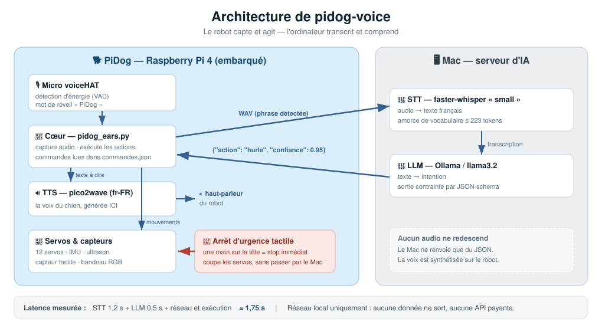
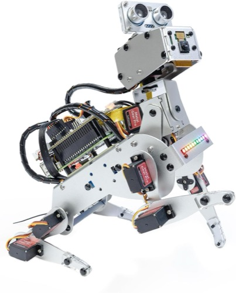
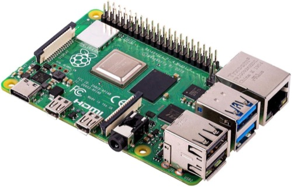

# 🐕 pidog-voice

**Commande vocale française pour le robot chien SunFounder PiDog.**
Le micro est sur le robot, le cerveau est sur votre ordinateur.

Parlez au chien, il obéit : *« PiDog, fais le loup »*, *« PiDog, donne la patte »*,
*« PiDog, son plus fort »*. Tout tourne **en local** — aucune donnée n'est envoyée
dans le cloud, aucune API payante.

**Ajouter une commande = éditer un fichier JSON.** Aucun code à écrire.

---

## Comment ça marche

<p align="center">
  
</p>

Le robot capte et agit ; l'ordinateur transcrit et comprend. Entre les deux, **du JSON
uniquement** : l'audio ne circule que dans le sens robot → Mac. La voix du chien est
synthétisée sur le Pi (`pico2wave`), jamais transmise par le réseau.

**~1,75 s** entre la fin de votre phrase et le premier mouvement.

### Pourquoi le cerveau n'est pas sur le robot

C'est la question qu'on se pose en premier. Nous l'avons mesurée :

| | transcription d'une phrase | charge | température |
|---|---|---|---|
| Mac Mini M2 Pro | **0,34 s** | — | — |
| Raspberry Pi 4 (`tiny`) | 2,9 s | **7,7** (4 cœurs) | **76 °C** |
| Raspberry Pi 4 (`base`) | 5,4 s | — | — |

Sur le Pi, Whisper monopolise les 4 cœurs : la boucle d'écoute est affamée, le robot
**cesse littéralement d'entendre**, et l'audio grésille. Le mode local existe quand même
(`PIDOG_STT=local`) comme repli hors-ligne.

---

## Installation

### Sur l'ordinateur (le cerveau)

```bash
pip install faster-whisper
ollama pull llama3.2                 # https://ollama.com
python3 mac/stt_server.py            # écoute sur le port 8770
```

### Sur le Raspberry Pi (le robot)

Prérequis : la librairie [SunFounder PiDog](https://github.com/sunfounder/pidog) installée.

```bash
scp -r commandes.json config.py pi/ demos/ outils/ pidog@<ip-du-robot>:~/pidog-voice/
ssh pidog@<ip-du-robot>
export PIDOG_MAC=http://<ip-de-votre-ordinateur>:8770
~/pidog-voice/pi/ears_loop.sh        # écoute supervisée
```

### Démarrage automatique

```bash
./install/mac_autostart.sh          # Mac : LaunchAgent (venv dédié créé au passage)
PIDOG_MAC=http://192.168.1.26:8770 PIDOG_MARCHE=1 ./install/pi_autostart.sh   # Pi : cron @reboot
```

Les deux s'ajoutent `--retirer` pour désinstaller. Le Mac relance le serveur s'il meurt
(`KeepAlive`), le Pi s'appuie sur `ears_loop.sh` qui supervise déjà l'écoute.

> **macOS** : ne placez pas le projet dans `~/Documents`, `~/Bureau` ou `~/Téléchargements`.
> La protection TCC interdit aux services lancés par `launchd` d'y accéder — le serveur
> ne peut même pas lire son propre venv (`Operation not permitted`). `~/pidog-voice` convient.

> **Raspberry Pi** : `cron` plutôt que systemd, pour n'exiger aucun privilège root.
> L'option `--boot` attend que PipeWire et le réseau soient prêts avant de démarrer.

---

## 🛑 Arrêt d'urgence

**Posez la main sur la tête du chien : il s'arrête immédiatement.**

Le capteur tactile est le seul moyen d'arrêt fiable pendant un déplacement, et il est
actif dès qu'une commande déplace le robot. La voix ne suffit pas :

- elle passe par le réseau et par Whisper — **1,2 s dans le meilleur cas** ;
- les servos en mouvement produisent un bruit **42× supérieur** au silence et couvrent
  la parole (mesuré : 35 à l'arrêt, 1513 en mouvement) ;
- Whisper peut partir en boucle sur du bruit — constaté, **39 s de transcription**
  pendant lesquelles le robot est totalement sourd.

Le tactile, lui, est local, instantané, et ne dépend de rien.

---

## Ajouter une commande

Tout se passe dans **`commandes.json`**, et rien d'autre. Ce fichier alimente les trois
étages à la fois : le vocabulaire de Whisper, le prompt du LLM, et les mouvements.

```json
"gratte": {
  "intention": "se gratter l'oreille, avoir des puces, se démanger",
  "phrases":   ["PiDog gratte-toi"],
  "exemples":  ["tu as des puces", "gratte toi l'oreille"],
  "reponse":   "Aaah ça fait du bien !",
  "sequence":  [{"preset": "scratch"}]
}
```

C'est tout. Le chien comprend désormais *« tu as des puces »*.

| champ | rôle |
|---|---|
| `intention` | décrit l'action au LLM — **c'est ce champ qui fait la précision** |
| `phrases` | oriente Whisper vers les tournures attendues |
| `exemples` | few-shot du LLM, pour les formulations indirectes |
| `sequence` | les mouvements (voir les verbes ci-dessous) |
| `deplace` | `true` = refusé tant que le robot est sur une table |

### Verbes de séquence

```json
{"action": "sit", "speed": 70}                  do_action() de la lib pidog
{"preset": "hand_shake"}                        pidog.preset_actions
{"son": "single_bark_1"}                        un son de ~/pidog/sounds
{"led": {"mode":"breath","color":"cyan"}}       bandeau RGB
{"tete": [0, 0, -20], "speed": 80}              mouvement de tête
{"pattes": [45,-25,-45,25,80,70,-80,-70]}       pose des pattes
{"pause": 0.5}                                  attente
{"dire": "texte"}                               synthèse vocale
{"repeter": 3, "etapes": [...]}                 boucle
{"builtin": "distance"}                         comportement Python
```

**Toujours valider avant de déployer :**

```bash
python3 outils/verifier_config.py --tokens
```

> ⚠️ Whisper tronque son amorce de vocabulaire à **223 tokens en gardant la fin**.
> Un fichier trop bavard fait donc disparaître les *premières* commandes — en silence,
> sans erreur. C'est exactement ce que ce validateur attrape.

---

## Les commandes livrées

Ce tableau est **généré depuis `commandes.json`** (`python3 outils/lister_commandes.py
--injecter`) : il ne peut donc pas mentir sur ce que le robot sait faire.

<!-- COMMANDES:debut -->
| Commande | Ce qu'il fait | Dites par exemple |
|---|---|---|
| `demo` | Jouer le spectacle complet | *« PiDog fais une demo »*, *« PiDog montre tes talents »*, *« pidog fais une demo »* |
| `patrouille` 🔒 | Partir explorer | *« PiDog patrouille »*, *« PiDog pars en ronde »* |
| `assis` | S'asseoir | *« PiDog assis »*, *« assieds toi »* |
| `debout` | Se lever | *« PiDog debout »* |
| `couche` | Se coucher | *« PiDog couche-toi »* |
| `aboie` | Aboyer | *« PiDog aboie »* |
| `hurle` | Hurler a la lune | *« PiDog hurle »*, *« PiDog fais le loup »*, *« fais le loup »* |
| `patte` | Donner la patte | *« PiDog donne la patte »* |
| `pompes` | Faire des pompes | *« PiDog fais des pompes »* |
| `danse` | Danser | *« PiDog danse »*, *« PiDog bouge ton corps »*, *« bouge ton corps »* |
| `gratte` | Se gratter l'oreille avec la patte arriere | *« PiDog gratte-toi »*, *« tu as des puces »* |
| `dodo` | Aller dormir | *« PiDog va dormir »*, *« PiDog bonne nuit »* |
| `stop` | Arreter immediatement | *« PiDog stop »*, *« PiDog arrete-toi »* |
| `distance` | Mesurer ou annoncer la distance de l'obstacle devant lui | *« PiDog qu'est-ce que tu as devant toi »*, *« y a quoi devant toi »* |
| `son_plus` | Monter le volume | *« PiDog son plus fort »*, *« PiDog augmente le son »*, *« pidog son plus fort »* |
| `son_moins` | Baisser le volume | *« PiDog son moins fort »*, *« PiDog baisse le son »*, *« pidog son moins fort »* |

🔒 = déplace le robot : refusé tant que `PIDOG_MARCHE=1` n'est pas défini (il est probablement sur une table).
<!-- COMMANDES:fin -->

Le chien accepte bien plus de formulations que celles-ci : c'est le LLM qui interprète
l'intention. *« montre-moi ce que tu sais faire »*, *« tu as des puces ? »* ou
*« on ne t'entend pas »* fonctionnent sans être listés nulle part.

### Renommer le robot

Le nom traverse les trois étages (mot de réveil, amorce Whisper, prompt du LLM).
Il tient dans un seul réglage :

```json
"reglages": {
  "nom": "Rex",
  "variantes_reveil": ["rexe", "raiks", "rek"]
}
```

Les `phrases` des commandes utilisent le marqueur `{nom}`, substitué au chargement —
rien d'autre à modifier. Pensez à **réécrire `variantes_reveil`** : ce sont les
déformations que la reconnaissance vocale fait subir au nom, et celles de « PiDog »
ne valent évidemment pas pour « Rex ». Le nom lui-même est ajouté automatiquement.

## 🚨 Sécurité : le robot est souvent sur une table

Toute commande marquée `"deplace": true` est **refusée** — le chien répond qu'il ne peut
pas, plutôt que de tomber de la table. Pour l'autoriser une fois au sol :

```bash
PIDOG_MARCHE=1 ~/pidog-voice/pi/ears_loop.sh
```

## Réglages

| variable | défaut | rôle |
|---|---|---|
| `PIDOG_MAC` | `http://cerveau.local:8770` | adresse du cerveau |
| `PIDOG_WHISPER` | `small` | `base` = 3× plus rapide, moins robuste |
| `PIDOG_MARCHE` | `0` | `1` autorise les déplacements |
| `PIDOG_VOLUME` | *(inchangé)* | volume PipeWire en % |
| `PIDOG_STT` | `mac` | `local` = Whisper sur le Pi (lent) |

---

## Pièges rencontrés (pour vous les épargner)

- **Le micro** : utilisez le device ALSA `plug:mic` ou `robothat`. `default` et `hw:`
  sont **muets** — le gain softvol ne leur est pas appliqué.
- **Le volume** : si le chien est inaudible, ce n'est probablement ni ALSA ni les fichiers
  sons, mais **PipeWire**, qui démarre souvent à 40 % (−24 dB).
  `pactl set-sink-volume @DEFAULT_SINK@ 100%`. Ne dépassez pas 100 % : ça grésille.
  Au passage, `robot_hat.music_set_volume()` **ne fait rien** — elle appelle
  `sudo amixer sset 'PCM'`, or ce contrôle n'existe pas sur cette carte.
- **Le mot de réveil est indispensable** : sans lui, le LLM invente une action sur une
  phrase de conversation ordinaire, avec une confiance de 0,8. Un seuil ne filtre rien.
- **Whisper ne connaît pas « PiDog »** et le transcrit « qui doit » ou « le pideau ».
  Le champ `phrases` corrige ça — mesuré : 0/5 → 5/5.
- **La qualité vient du prompt, pas de la taille du modèle.** Décrire chaque action et
  donner des exemples a fait passer llama3.2 de 75 % à 93 % — mieux qu'un modèle deux
  fois plus gros avec un prompt pauvre, et deux fois plus rapide.

---

## 🤝 Le matériel du projet

*Liens partenaires Amazon : si vous achetez via ces liens, le projet touche une petite
commission, sans surcoût pour vous. Cela n'influence pas ce qui est écrit ici — ce sont
simplement les trois machines sur lesquelles ce code a été développé et testé.*

<table>
<tr>
<td align="center" width="33%">
  <a href="https://link.amazon/B0bYWa5Tm"></a><br>
  <b>SunFounder PiDog</b><br>
  <sub>Le robot chien</sub>
</td>
<td align="center" width="33%">
  <a href="https://link.amazon/B0jdCWkVR"></a><br>
  <b>Raspberry Pi 4</b><br>
  <sub>Le corps — embarqué dans le chien</sub>
</td>
<td align="center" width="33%">
  <a href="https://link.amazon/B0bhYDJWI"></a><br>
  <b>Apple Mac Mini</b><br>
  <sub>Le cerveau — Whisper + Ollama</sub>
</td>
</tr>
</table>

## ☕ Offrez-moi un café

Ce projet est gratuit et open source. S'il vous est utile, vous pouvez me remercier
en m'offrant un café — il suffit de scanner ce QR code PayPal. Merci beaucoup ! 🙏

<p align="center">
  
</p>

---

## Licence

[MIT](LICENSE) © 2026 koua29

Construit avec [Claude Code](https://claude.com/claude-code).
Repose sur [SunFounder PiDog](https://github.com/sunfounder/pidog),
[faster-whisper](https://github.com/SYSTRAN/faster-whisper) et [Ollama](https://ollama.com).
